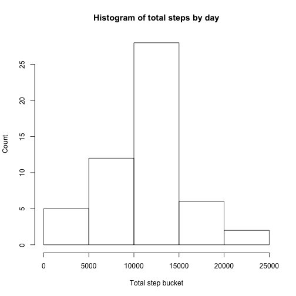
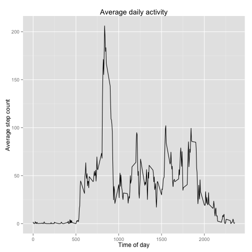
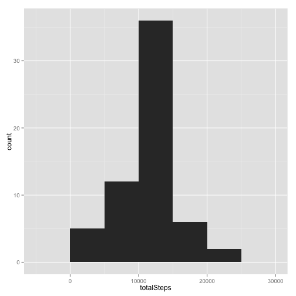
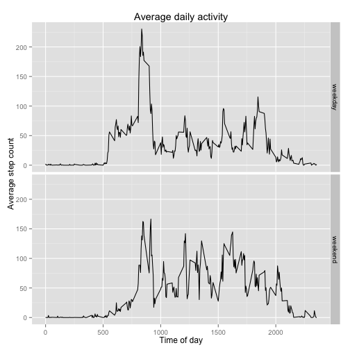

## Loading and preprocessing the data


```r
activityMonitoring <- read.csv(unz("activity.zip", "activity.csv"),
                               colClasses = c("integer", "Date", "integer"))
```

## What is mean total number of steps taken per day?


```r
totalStepsByDay <- tapply(activityMonitoring$steps, activityMonitoring$date, sum)
hist(totalStepsByDay,
     main = "Histogram of total steps by day",
     xlab = "Total step bucket",
     ylab = "Count")
```

 

```r
meanSteps <- mean(totalStepsByDay, na.rm = T)
medianSteps <- median(totalStepsByDay, na.rm = T)
```
Across all days measured, the median number of total steps taken was 10765 and the mean amount was 1.0766189 &times; 10<sup>4</sup>.

## What is the average daily activity pattern?


```r
library(dplyr)
library(ggplot2)
activityPattern <- activityMonitoring %>%
    group_by(interval) %>%
    summarise(activityByInterval = mean(steps, na.rm = T))
mostActiveInterval <- activityPattern[which.max(activityPattern$activityByInterval), 1]
ggplot(activityPattern, aes(interval, activityByInterval)) +
    geom_line() +
    labs(title="Average daily activity", x="Time of day", y="Average step count")
```

 

The time interval with the greatest average activity is 835.

## Imputing missing values

I decided to do my imputing by just using the mean steps for the corresponding 5-minute interval across all days, as I computed in the last section. I considered using a more sophisticated imputation system like Amelia or mice, but didn't get either to produce wholly satisfactory results. 


```r
numMissingStepCounts <- sum(!complete.cases(activityMonitoring))
imputed <- activityMonitoring
missingCounts <- is.na(activityMonitoring$steps)
imputed$steps[missingCounts] <- rep(activityPattern$activityByInterval, 61)[missingCounts]

imputedStepsByDay <- imputed %>% group_by(date) %>% summarise(totalSteps = sum(steps))
meanImputed <- mean(imputedStepsByDay$totalSteps)
medianImputed <- median(imputedStepsByDay$totalSteps)
ggplot(imputedStepsByDay, aes(totalSteps)) + geom_histogram(binwidth=5000)
```

 

Across all days measured, the median number of total steps taken was 1.0766189 &times; 10<sup>4</sup> and the mean amount was 1.0766189 &times; 10<sup>4</sup>.

Considering how I went about imputing, it makes sense that the mean was not changed, particularly if NAs appear in day-sized chunks. The median was shifted to exactly the mean, since days with mean values were added to the data set. This suggests that there was little skewness in the distribution of total steps per day.

## Are there differences in activity patterns between weekdays and weekends?


```r
imputed$weekPart <- as.factor(
    ifelse(weekdays(imputed$date) %in% c("Saturday", "Sunday"),
        "weekend",
        "weekday"))
activitySplit <- imputed %>% 
    group_by(interval, weekPart) %>%
    summarise(activityByInterval = mean(steps))
ggplot(activitySplit, aes(interval, activityByInterval)) +
    geom_line() +
    facet_grid(weekPart~.) +
    labs(title="Average daily activity", x="Time of day", y="Average step count")
```

 

The step pattern on weekends seems different from that during the week. It's shifted a little later in the day (unsurprising, given how many of us are during the weekend). Activity is also spread out much more throughout the day, possibly suggesting that the big spike in walking around 8:30 is job or school related.
